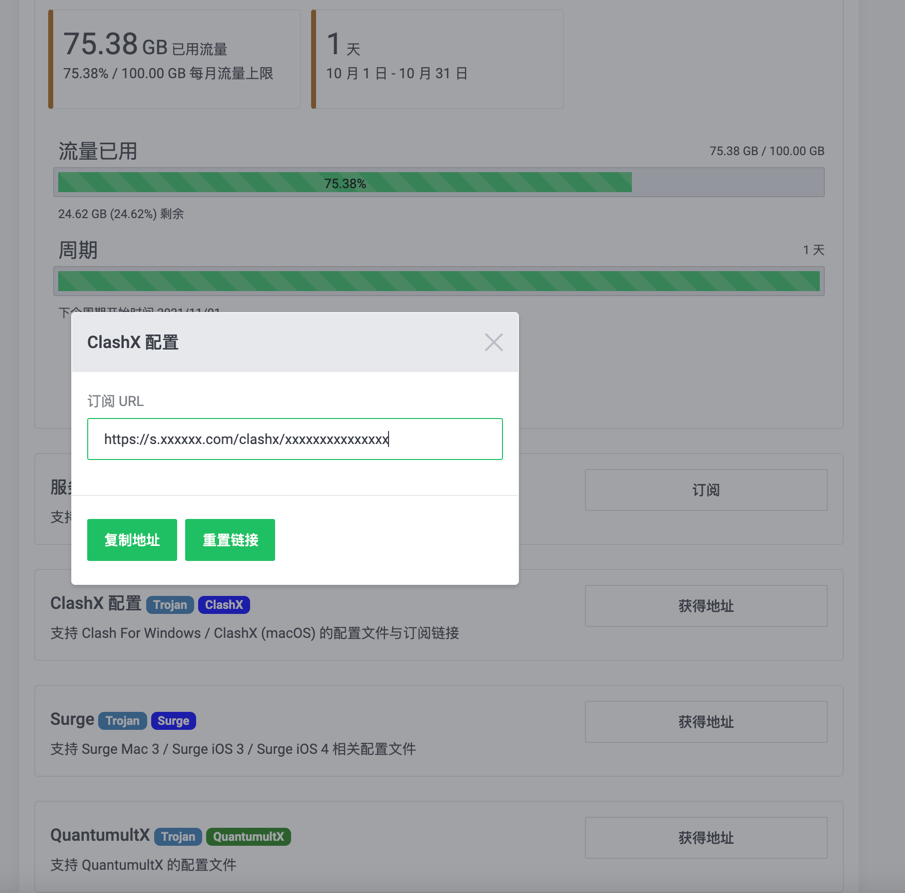
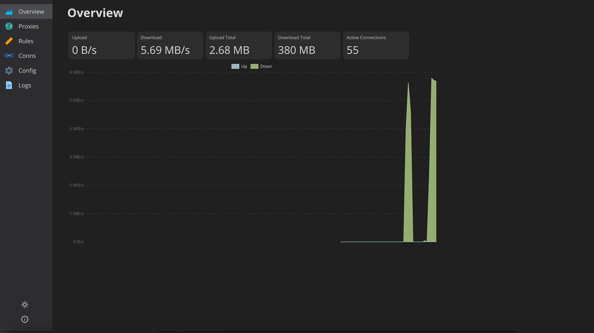
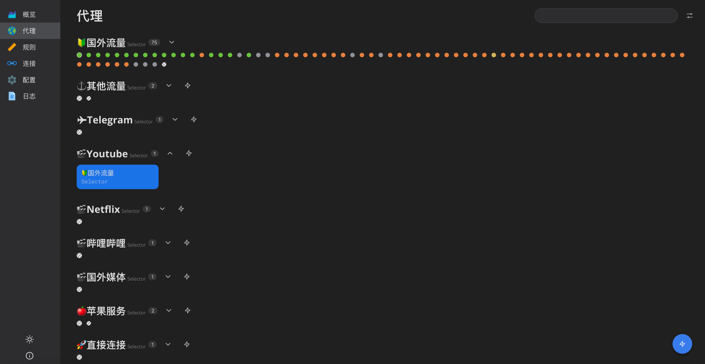

## Clash Pro

*Used for auto update provider clash config file.*

Current only support [shadowsocks supplier](https://portal.shadowsocks.nz/aff.php?aff=6346
)

You can click **ClashX配置** get the provider config subscribe url.


## How Use

```shell
docker run -it -d --rm -p 7890:7890 -p 9090:9090 -p 5353:5353 -p 7892:7892 -e provider_url="https://xxx.com/xxx/subscribe" abcdelf/clash_pro
```

```yml
version: "3"
services:
  clash:
    container_name: clash_pro
    image: abcdelf/clash_pro
    environment:
      - provider_url=https://xxx.com/xxx/subscribe
      #- check_interval=1
      #- api_secret=123456
      #- proxy_authentications=abc:abc
    ports:
      - "7890:7890"
      - "7892:7892"
      - "5353:5353/tcp"
      - "5353:5353/udp"
      - "9090:9090"
    volumes:
      - /clash/config/config.yaml:/root/.config/clash/config.yaml
      - /clash/config/config_template.yaml:/root/.config/clash/config_template.yaml
    restart: unless-stopped
```

## Ui
*[yacd clash ui](https://github.com/haishanh/yacd) Inside*



